# Elastic Beanstalk

AWS Elastic Beanstalk is a Platform as a Service (PaaS) from AWS that lets you deploy, run, and scale applications without worrying about infrastructure.

## You focus on:

* Writing code

* Choosing a runtime (Node.js, Java, Python, etc.)

## AWS handles:

* Servers (EC2)

* Load balancing

* Auto scaling

* Monitoring

* OS & runtime setup

Supported technologies

## Elastic Beanstalk supports common app stacks:

* Node.js

* Java (Spring Boot, Tomcat)

* Python (Flask, Django)

* PHP

* Ruby

* .NET

* Go

* Docker

--- 

# 💗 Core Components 

* Application 

* Application Version 

* Environment 

* Platform 

# 📦 Application

### 🌍 Environments
*   Infrastructure (EC2 instances, load balancers, auto-scaling groups, etc.)

*   Runs a single application version at a time
*   An application can have many environments (like dev and test)

### 📦 Application Versions
*   Application code

*   Stored in S3
*   An application can have many application versions (supporting rollback, etc.)

### ⚙️ Saved Configurations
*   Defines how an environment and its resources behave

*   Can be used to launch new environments
*   An application can have many saved configurations

# Hands on 

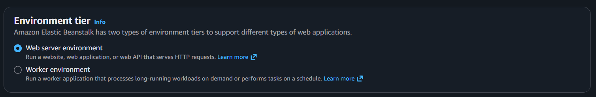

| Feature               | Web Server | Worker |
| --------------------- | ---------- | ------ |
| Handles HTTP requests | ✅ Yes      | ❌ No   |
| Load Balancer         | ✅ Yes      | ❌ No   |
| Uses SQS              | ❌ No       | ✅ Yes  |
| Background jobs       | ❌ No       | ✅ Yes  |
| APIs & websites       | ✅ Yes      | ❌ No   |

## Web Server Environment

* Used to run websites, web applications, and APIs

* Handles HTTP/HTTPS requests directly from users

* Automatically creates EC2 instances, Load Balancer, and Auto Scaling

* Suitable for Node.js, Java, Python, PHP APIs

* Best for real-time user responses

### Example:

A user opens a website or calls an API and gets an immediate response.

## Worker Environment

* Used for background and long-running tasks

* Does not handle HTTP requests

* Uses Amazon SQS to receive jobs

* EC2 instances pick tasks from the queue and process them

* Best for email sending, image processing, report generation

### Example:
After a user places an order, a background job sends a confirmation email.

--- 

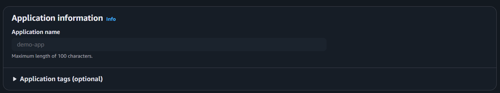

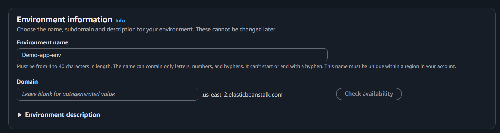

In AWS Elastic Beanstalk, the platform defines the technology stack used to run your application. It tells AWS which programming language, operating system, and runtime version should be installed on the EC2 instances. Based on the selected platform, Elastic Beanstalk automatically provisions servers, installs the required runtime, and configures everything needed to run your application.

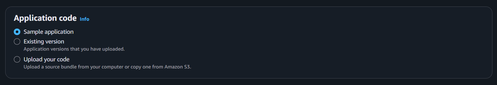

In AWS Elastic Beanstalk, Application code decides which code will be deployed and run inside the environment. When you create an environment, you can choose to run a sample app, use an existing uploaded version, or upload your own application code.

### Sample application

* Default demo app provided by AWS

* Used only for testing and learning

* No code upload required

### Existing version

* Uses a previously uploaded application version

* Helpful for redeploying or rolling back

* Ensures the same code runs again

### Upload your code

* Deploys your own application

* Upload code as a ZIP file or from Amazon S3

* Used for real and production applications

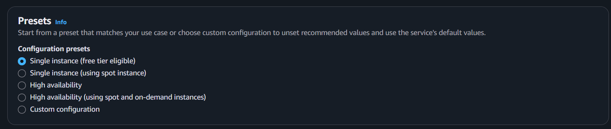

In AWS Elastic Beanstalk, Presets are ready-made configuration templates that quickly set up your environment based on common use cases. Instead of configuring everything manually, you choose a preset and Elastic Beanstalk automatically applies recommended settings for instances, scaling, and availability.

## Single instance (free tier eligible)

* Runs your app on one EC2 instance

* No load balancer

* Lowest cost option

* Best for learning, testing, and small apps

* If the instance fails, the app goes down

## Single instance (using Spot instance)

* Runs on one Spot EC2 instance

* Cheaper than normal EC2

* Instance can be stopped by AWS anytime

* Suitable for non-critical apps

## High availability

* Runs on multiple EC2 instances

* Includes a Load Balancer

* Supports Auto Scaling

* App stays online even if one instance fails

* Best for production applications

## High availability (using Spot and On-Demand)

* Mix of On-Demand + Spot instances

* Lower cost with high availability

* On-Demand ensures stability

* Spot reduces cost when available

* Common choice for cost-optimized production

## Custom configuration

* Full control over instances, scaling, networking

* No preset values applied

* Best for advanced or specific requirements

## Simple way to remember

* Single instance → cheap & simple

* High availability → safe & scalable

* Spot instances → cheaper but less reliable

* Custom → full control

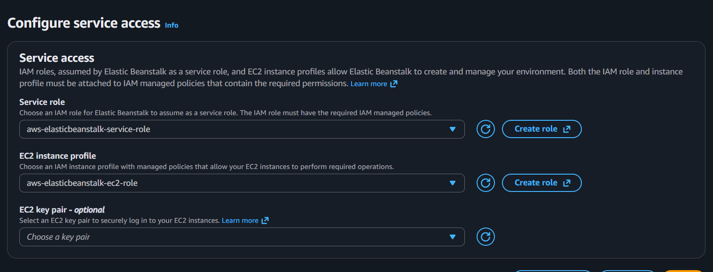

In AWS Elastic Beanstalk, Configure service access defines which IAM roles Elastic Beanstalk and its EC2 instances use to access other AWS services. These roles control permissions securely, without hard-coding credentials in your application.

## Service role selected
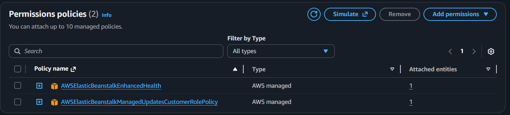

* Role name: `aws-elasticbeanstalk-service-role`

* This role is used by Elastic Beanstalk itself

* Allows Elastic Beanstalk to:

* Create and manage EC2 instances

* Configure Load Balancers

* Manage Auto Scaling

* Send logs and health data to CloudWatch

* This is the correct and recommended service role

## EC2 instance profile selected
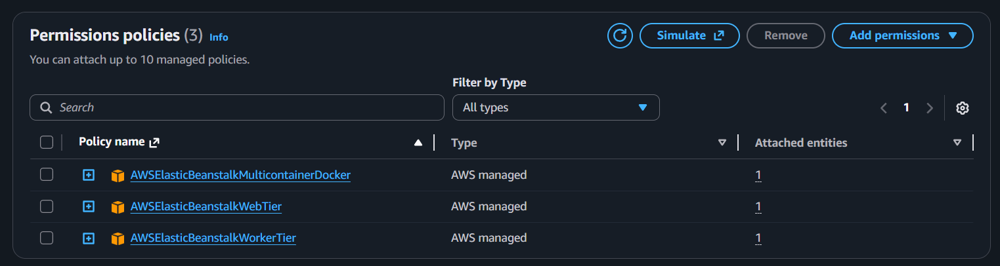

* Role name: `aws-elasticbeanstalk-ec2-role`

* This role is attached to the EC2 instances running your app

* Allows EC2 instances to:

* Download application code from S3

* Send logs to CloudWatch

* Access other AWS services if needed

* This role gives permissions to your application at runtime

--- 

In AWS Elastic Beanstalk, Instance settings define where your application’s EC2 instances run inside the network. This section controls the VPC, public IP assignment, and subnets (Availability Zones) used by your environment to ensure proper connectivity, security, and availability.

## VPC (Virtual Private Cloud)

* You selected the default VPC

* VPC ID: `vpc-023c995c028811f2e`

* CIDR: `172.31.0.0/16`

* This means your application runs inside AWS’s default network setup

* Suitable for learning, testing, and most simple production apps

## Public IP address

* Disabled in your configuration

* EC2 instances will not get public IPs

* Instances can be accessed only internally (recommended for security)

* Public traffic is expected to go through a Load Balancer if enabled

## Instance subnets (selected)

You selected two subnets across different Availability Zones:

us-east-2a → 172.31.0.0/20

us-east-2c → 172.31.32.0/20

This provides:

* High availability

* Protection against AZ failures

* Better scaling across zones

## Why multiple subnets matter

* Elastic Beanstalk launches EC2 instances across selected AZs

* If one AZ goes down, the app can still run in the other

* Required for production-ready setups

## 🔥 Configure Instance Traffic and Scaling 

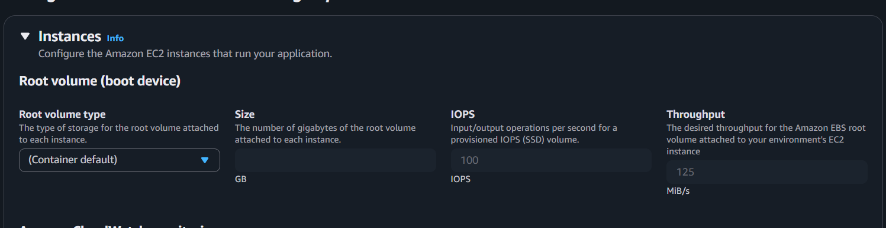

In AWS Elastic Beanstalk, the Root volume (boot device) defines the storage attached to each EC2 instance where the operating system, runtime, and application files are stored. These settings control the type of storage, size, performance (IOPS), and data throughput for your application instances.

### Root volume type

* Set to Container default

* Elastic Beanstalk automatically chooses the best EBS volume type

* No manual tuning needed for most applications

* Recommended unless you have special performance needs

### Size (GB)

* Defines the disk size of the root volume

Stores:

* OS files

* Application code

* Logs

* Temporary data

Increase size if:

* App generates many logs

* App uses large dependencies

### IOPS

* Input/Output Operations Per Second

* Set to 100 IOPS

* Controls how fast the disk can read/write small data

* Important for database-heavy or log-heavy workloads

### Throughput

* Set to 125 MiB/s

* Controls data transfer speed for large files

Important for:

* File processing

* Media-heavy apps

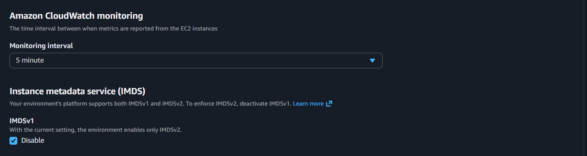

In AWS Elastic Beanstalk, these settings control how your EC2 instances are monitored and how they securely access instance metadata. They affect performance visibility, cost, and security of your running environment.

### Amazon CloudWatch monitoring

* Monitoring interval: **5 minutes**

* EC2 instances send metrics (CPU, memory, disk, network) to Amazon CloudWatch

* 5-minute interval = basic monitoring

* Lower cost and sufficient for most applications

* Shorter intervals (like 1 minute) give faster alerts but cost more

In AWS Elastic Beanstalk, EC2 security groups act as a virtual firewall that controls incoming and outgoing network traffic for the EC2 instances running your application. They define which ports, protocols, and IP addresses are allowed or blocked.

### 🏷️ Auto Scaling Groups

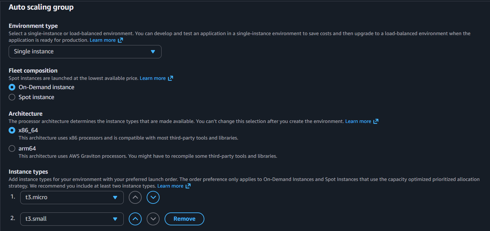

In AWS Elastic Beanstalk, Auto Scaling Group settings define how many EC2 instances run your application, what type they are, and how they scale. These settings control cost, performance, and availability of your environment.

### Environment type

* Selected: `Single instance`

* Runs your app on one EC2 instance

* No load balancer and no scaling

* Best for development, testing, or low-traffic apps

* Lowest cost option

### Fleet composition

* Selected: `On-Demand instance`

* Instance is always available

* No sudden termination (unlike Spot)

* More stable but slightly more expensive

### Architecture

* Selected: `x86_64`

* Compatible with most libraries and tools

* Works well with Node.js and common npm packages

* More flexible than ARM for beginners

### Instance types

* Primary: `t3.micro`

* Secondary: `t3.small`

* Elastic Beanstalk tries to launch instances in priority order

* `t3.micro` is free-tier eligible

* `t3.small` is used if the primary type isn’t available

---

## 🔥 Configure Updates, Monitoring, Logging

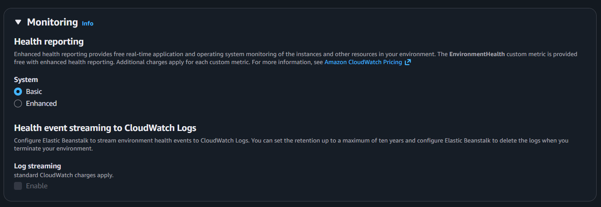

In AWS Elastic Beanstalk, Monitoring and Health Reporting determine how the system tracks the health of your application and environment. These settings help you understand whether your app is running correctly and how quickly you are notified when problems occur.

### Health reporting system

* Selected: `Basic`

* Provides simple health status of the environment

Shows overall states like:

* Green (OK) 💚

* Yellow (Warning) 💛

* Red (Error) 💔

* Uses minimal metrics

* No extra cost

### Enhanced health reporting (not selected)

* Gives detailed, real-time monitoring

Tracks:

* Instance health

* Application response codes

* OS-level metrics

* Publishes custom metrics to Amazon CloudWatch

* May incur additional CloudWatch charges

* Best for production environments

### Health event streaming to CloudWatch Logs

* Disabled in your configuration

When enabled:

* Health events are streamed to CloudWatch Logs

* You can store logs up to 10 years

* Useful for auditing and troubleshooting

* Standard CloudWatch log charges apply

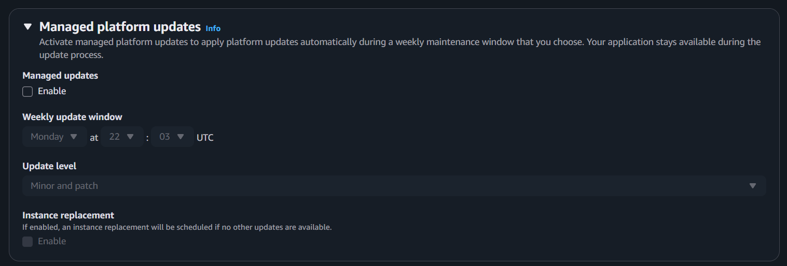

In AWS Elastic Beanstalk, Managed Platform Updates allow AWS to automatically apply platform updates (such as OS patches, runtime updates, and security fixes) during a scheduled maintenance window, while keeping your application available.

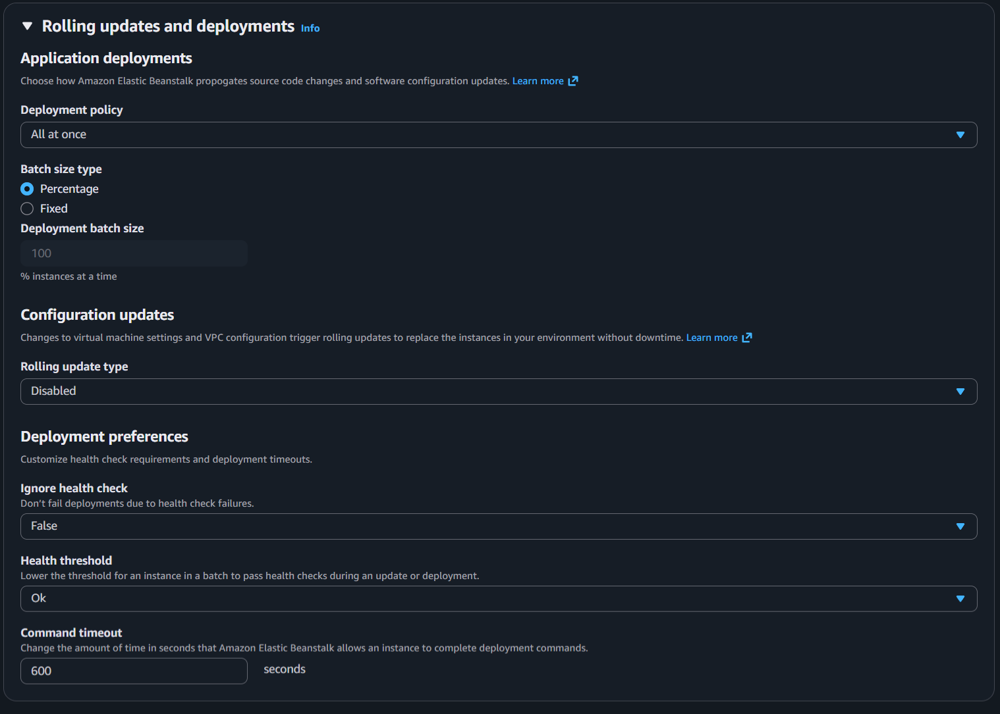

In AWS Elastic Beanstalk, Rolling updates and deployments control how new application versions and configuration changes are rolled out to EC2 instances. These settings decide whether deployments cause downtime, how many instances are updated at a time, and how health checks affect the deployment process.

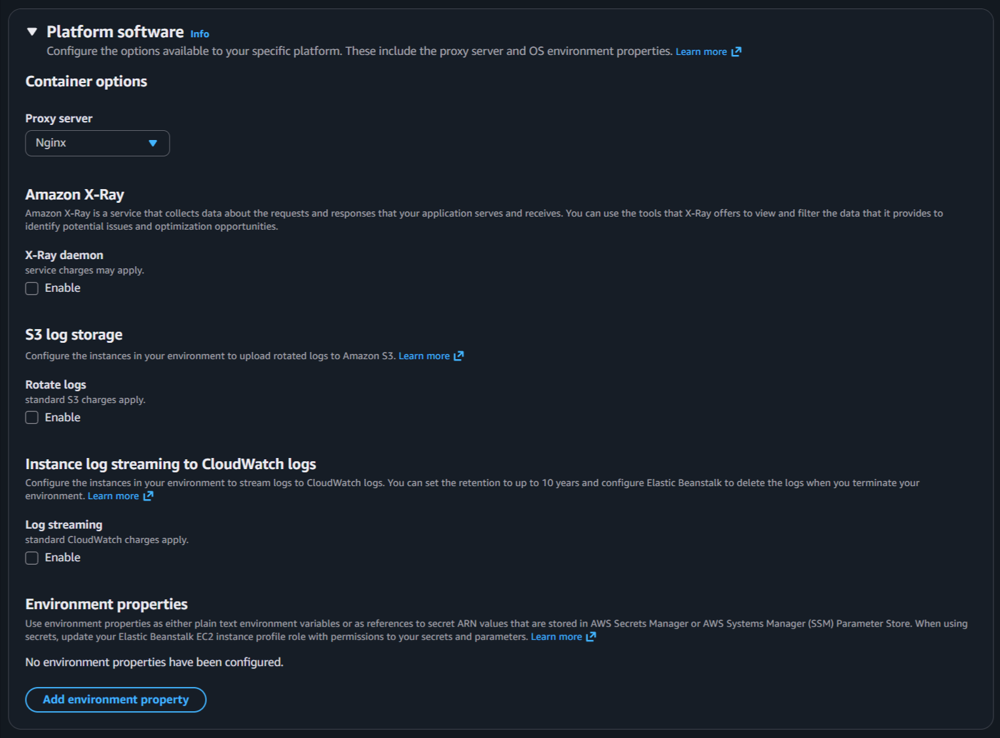

In AWS Elastic Beanstalk, Platform software settings control platform-level features provided by AWS, such as the proxy server, tracing, logging, and environment variables. These options help manage traffic flow, observability, and configuration without changing application code.