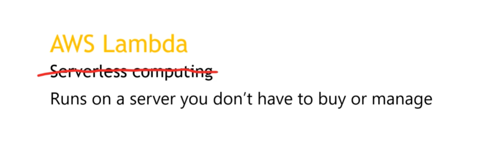
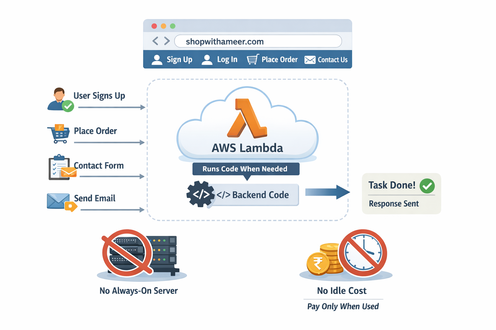
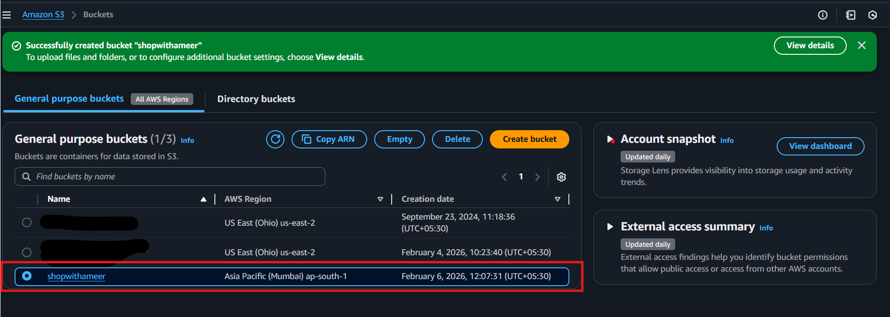

# AWS LAMBDA

Imagine I own a website called `shopwithameer.com`. Users visit the site, sign up, log in, place orders, submit contact forms, and receive emails. Instead of running a backend server 24/7, I use AWS Lambda. Whenever a user performs an action—like submitting a contact form or logging in—AWS Lambda runs a small piece of backend code, completes the task, and then stops. There is no always-running server, no manual scaling, and no idle cost. The backend logic runs only when required.

### ⚡ What is AWS Lambda?

AWS Lambda is a serverless compute service that allows you to run backend code without creating, managing, or maintaining servers. You only upload your function (code), and AWS automatically executes it when an event occurs, such as an HTTP request, file upload, or database update. Once the execution is complete, Lambda automatically shuts down, making it efficient and cost-effective.

* No server creation or management

* Code runs only when triggered

* Supports Node.js, Python, Java, etc.

* Fully managed by AWS

### ⚡ Why we need Lambda

Traditional backend servers like EC2 must run continuously, even when no users are accessing the application, which leads to unnecessary costs and maintenance. AWS Lambda removes this problem by running code only when it is needed. This makes it ideal for modern applications that require scalability, low cost, and fast development.

* Avoids 24/7 server costs

* No OS or server maintenance

* Faster development and deployment

* Automatic scaling

## ⚡ Benefits of Lambda

### 1. 🔥 Single purpose

Each AWS Lambda function is created to do one specific task only, such as user login, sending an email, or processing an order. This keeps the code simple, easy to debug, and easy to update without affecting other parts of the application.

* One function = one responsibility

* Easier to test and maintain

* Failures don’t affect the whole system

### 🔥 2. Right Sized 

AWS Lambda automatically provides the exact amount of memory and CPU needed for your code. You don’t over-allocate resources like in traditional servers, so there is no wastage.

* No guessing server size

* Uses only required resources

* Better performance for small tasks

### 🔥 3. Easy to scale (up AND down)

AWS Lambda automatically handles scaling. If one user visits your site, Lambda runs once. If 1 lakh users visit at the same time, Lambda runs thousands of copies automatically. When traffic reduces, it scales back down without any manual work.

* No load balancer setup

* No manual scaling

* Handles sudden traffic spikes easily

## ⭐ Uses of Lambda

| **Use Case**                          | **What AWS Lambda Does**                                              | **Real-Time Example**                                    |
| ------------------------------------- | --------------------------------------------------------------------- | -------------------------------------------------------- |
| **File processing**                   | Automatically processes files when they are uploaded to **Amazon S3** | Resize images, convert file formats, scan uploaded files |
| **Long-running workflows**            | Runs multi-step workflows that remember progress (up to 1 year)       | Order processing, approval flows, human reviews          |
| **Database operations & integration** | Responds to database changes and automates data tasks                 | Sync data, send alerts when data changes                 |
| **Scheduled & periodic tasks**        | Runs tasks automatically on a schedule using EventBridge              | Daily reports, cleanup jobs, backups                     |
| **Stream processing**                 | Processes real-time streaming data                                    | Log analysis, real-time monitoring, analytics            |
| **Web applications**                  | Builds scalable web backends that auto-adjust to traffic              | Login systems, form submissions, APIs                    |
| **Mobile backends**                   | Provides secure APIs for mobile and web apps                          | Authentication, notifications, user data                 |
| **IoT backends**                      | Handles requests from IoT devices and third-party APIs                | Sensor data processing, device communication             |

## ⭐ How Lambda Works

When you use AWS Lambda, your only responsibility is writing the code. AWS takes care of everything else, such as servers, operating systems, scaling, capacity, and logging. You do not create or manage any machines. Lambda automatically runs your code on a highly available infrastructure whenever it is needed and stops it when the work is finished.

### ⚡ Serverless and event-driven model
AWS Lambda is a serverless and event-driven service. This means your code does not run continuously. Instead, it runs only when an event happens, such as a file upload to S3, an API request, a database update, or a scheduled time. This is different from traditional web applications, where servers run all the time waiting for requests.

### ⚡ Lambda functions (your code)

In AWS Lambda, you write your code as Lambda functions. Each function is a small piece of code that performs a specific task, such as processing a file, handling a request, or sending an email. These functions are the main building blocks of a Lambda-based application.

### ⚡ Security and permissions

AWS Lambda uses permissions and execution roles to control security. An execution role defines what AWS services your Lambda function is allowed to access, such as S3, DynamoDB, or CloudWatch. This ensures your function only has the permissions it needs and nothing more.

### ⚡ Event sources and triggers

Lambda functions are triggered by event sources. When an event occurs, the event data is sent to Lambda in JSON format. Lambda receives this data, processes it using your code, and returns the result.

### ⚡ Runtime and execution environment

AWS Lambda runs your code using language-specific runtimes, such as Node.js or Python. Each function runs inside an execution environment that includes the runtime, your code, libraries (layers), and any extensions. AWS fully manages this environment for you.

---

### ⚡Configure, control, and deploy secure applications

| **Feature**               | **What it Does (Simple)**                        | **Why It’s Useful**                           |
| ------------------------- | ------------------------------------------------ | --------------------------------------------- |
| **Environment variables** | Change app behavior without changing code        | Faster updates, safer configuration           |
| **Versions**              | Run multiple versions of the same function       | Test new features without breaking production |
| **Lambda layers**         | Share common libraries and code across functions | Cleaner code, easier maintenance              |
| **Code signing**          | Ensures only approved code is deployed           | Strong security and compliance                |

### ⚡ Scale and perform reliably

| **Feature**                        | **What it Does (Simple)**                             | **Why It’s Useful**                      |
| ---------------------------------- | ----------------------------------------------------- | ---------------------------------------- |
| **Concurrency & scaling controls** | Control how many functions run at the same time       | Prevent overload during traffic spikes   |
| **Lambda SnapStart**               | Reduces cold start time to sub-second                 | Faster response, better user experience  |
| **Response streaming**             | Sends large responses in parts instead of all at once | Real-time processing, better performance |
| **Container images**               | Package Lambda with complex dependencies              | Works well with large or custom setups   |

## ⭐ Programming models in AWS Lambda

AWS Lambda provides two programming models. The first is standard Lambda functions, which are used for short tasks and can run for up to 15 minutes. The second is Durable Functions, which are designed for long-running and stateful workflows and can run for up to one year. Both models use the same basic Lambda concepts, but Durable Functions add features to pause execution, save state, and resume later.

### ⚡ Standard Lambda functions

Standard Lambda functions are best for short, fast operations such as API requests, file processing, or database updates. Each time an event occurs, Lambda runs your function, completes the task, and stops.

Points

* Maximum execution time: 15 minutes

* Stateless by default

* Ideal for APIs, background jobs, automation

* Runs code only when triggered

### ⚡ Durable Functions (long-running workflows)

Durable Functions are used when tasks take a long time or need to remember progress. They can pause execution, wait for human approval or external events, and then continue exactly where they stopped. Lambda automatically saves and restores the state.

##  ⭐ Standard vs Durable Functions

| Feature                      | Standard Lambda   | Durable Functions    |
| ---------------------------- | ----------------- | -------------------- |
| Max execution time           | 15 minutes        | Up to 1 year         |
| State management             | Stateless         | Stateful             |
| Pause & resume               | ❌ No              | ✅ Yes                |
| Resource usage while waiting | Uses resources    | No resource usage    |
| Failure handling             | Manual            | Automatic retries    |
| Best use case                | APIs, short tasks | Workflows, approvals |

## ⚡ What is an event in AWS Lambda?

An event is anything that causes a Lambda function to run. Lambda does not run all the time. It runs only when an event happens, such as a file upload, an API request, or a message arriving in a queue.

* Event = trigger for Lambda

* Events start function execution

* Event data is sent as JSON

## ⚡ Event Data Format 

When Lambda is triggered, the event information is passed to the function in JSON format. The structure of the JSON depends on the service that generated the event.

* JSON contains event details

* Format varies by AWS service

* Function processes one event at a time

## ⭐ Task

Today, we are going to understand a simple real-time AWS Lambda use case where a user uploads a file to Amazon S3, and that upload automatically triggers an AWS Lambda function. The Lambda function then processes the file and produces an output, such as identifying or setting the correct content type. This shows how AWS Lambda works in an event-driven way without running any server.

## ⚡ Creating a bucket in S3

* It is important to create the S3 bucket in the same region as the Lambda function.