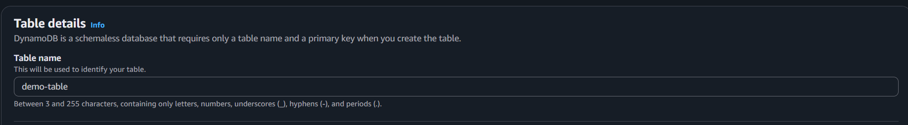
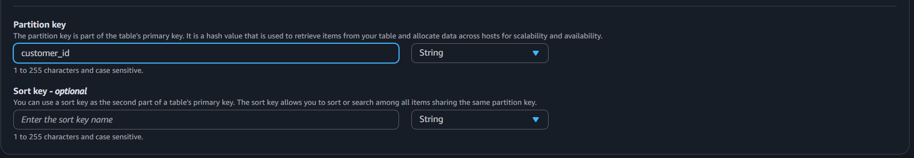
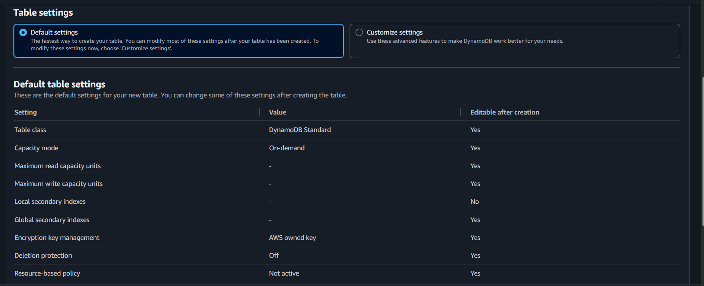
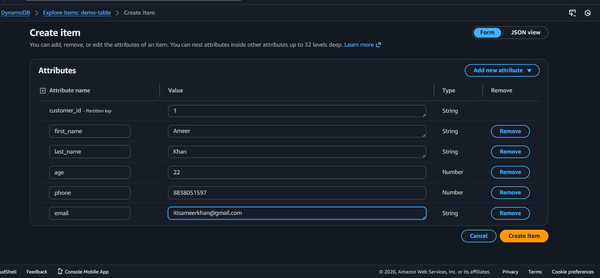

# DynamoDB


### **Amazon DynamoDB**

**Amazon DynamoDB** is a fully managed NoSQL database service provided by Amazon Web Services (AWS). It is designed to handle large amounts of data with very low latency and automatic scaling. DynamoDB stores data in key-value and document format and is commonly used for web applications, mobile apps, gaming backends, and real-time systems. Since it is fully managed, AWS handles servers, scaling, backups, and maintenance.

---

### **Key Features**

| Feature           | Meaning                               | Purpose                      |
| ----------------- | ------------------------------------- | ---------------------------- |
| Fully Managed     | No server management required         | Reduces operational effort   |
| NoSQL Database    | Key-value & document storage          | Flexible data model          |
| Automatic Scaling | Adjusts capacity automatically        | Handles traffic spikes       |
| Low Latency       | Millisecond response time             | Fast application performance |
| High Availability | Data replicated across multiple zones | Reliable and fault-tolerant  |

---

### **How Data is Stored**

DynamoDB stores data in **Tables**.

Each table contains:

* Items (like rows)
* Attributes (like columns)
* Primary Key (Partition key + optional sort key)

Example item:

```json
{
  "userId": "101",
  "name": "Ameer",
  "email": "ameer@gmail.com"
}
```

---

### **Primary Key Concept**

Every DynamoDB table must have a primary key:

* **Partition Key** → Distributes data across storage nodes
* **Sort Key (optional)** → Helps organize related data

This is similar to partition key in Cosmos DB.

---


### **Simple Comparison with Azure Cosmos DB**

| DynamoDB             | Cosmos DB                           |
| -------------------- | ----------------------------------- |
| AWS service          | Azure service                       |
| Key-value & document | Multi-model (document, graph, etc.) |
| On-demand billing    | Serverless or provisioned RU        |
| Global tables        | Multi-region replication            |

---

## ⭐ Characteristics

### ⚡Single-digit millisecond performance at any scale

* DynamoDB was purpose-built to improve upon the performance and scalability of relational databases to deliver single-digit millisecond performance at any scale

* It omits features that are inefficient and non-performing at scale, for example, JOIN operations.

* DynamoDB delivers consistent single-digit millisecond performance for your application, whether you have 100 or 100 million users.

### ⚡Importing and exporting data to Amazon S3

* Integrating DynamoDB with Amazon S3 enables you to easily export data to an Amazon S3 bucket for analytics and machine learning. 

### ⚡ DynamoDB pricing

* DynamoDB charges for reading, writing, and storing data in your tables, along with any optional features you choose to enable. DynamoDB has two capacity modes with their respective billing options for processing reads and writes on your tables: on-demand and provisioned.

* DynamoDB is also included in the always free tier, providing 25 GB of storage. The Always free tier also includes 25 provisioned Write and 25 provisioned Read Capacity Units (WCU, RCU) which is enough to handle 200 M requests per month.

## ⭐ DynamoDB Read and Write Capacity

Amazon DynamoDB uses capacity units to measure how much read and write activity your table can handle. The number of units consumed depends on the item size, type of operation, and consistency level.

### **DynamoDB Read and Write Capacity – Summary**

Amazon DynamoDB uses **capacity units** to measure how much read and write activity your table can handle. The number of units consumed depends on the item size, type of operation, and consistency level.

---

## **Read Capacity Units (RCU)**

Read capacity depends on:

* Item size (rounded up to next 4 KB)
* Consistency type (Strong, Eventual, Transactional)

### Basic Rules

| Read Type             | Capacity Needed (for item ≤ 4 KB) |
| --------------------- | --------------------------------- |
| Strongly Consistent   | 1 Read Unit                       |
| Eventually Consistent | 0.5 Read Unit                     |
| Transactional Read    | 2 Read Units                      |

### Important Points

* Item size is rounded up to the next **4 KB**.
* If item is larger than 4 KB, more read units are required.
* Even if the item doesn’t exist, capacity is still consumed.
* Query and Scan charge based on total data evaluated (not just returned).
* Selecting fewer attributes does NOT reduce read capacity usage.

---

## **Write Capacity Units (WCU)**

Write capacity depends on:

* Item size (rounded up to next 1 KB)
* Normal or transactional write

### Basic Rules

| Write Type          | Capacity Needed (for item ≤ 1 KB) |
| ------------------- | --------------------------------- |
| Normal Write        | 1 Write Unit                      |
| Transactional Write | 2 Write Units                     |

### Important Points

* Item size is rounded up to the next **1 KB**.
* Larger items consume more write units.
* UpdateItem uses capacity based on the larger of before/after size.
* Conditional writes consume capacity even if they fail.
* Batch operations calculate each item separately.

---

## **Simple Comparison**

| Operation   | Rounding Size | Key Rule               |
| ----------- | ------------- | ---------------------- |
| Read        | 4 KB          | Depends on consistency |
| Write       | 1 KB          | Depends on item size   |
| Transaction | Double cost   | Stronger guarantees    |

---

## ⭐ Creating a Table





### **Partition Key (DynamoDB)**

In Amazon DynamoDB, the Partition Key is the main part of the table’s primary key. It is used to uniquely identify items and to distribute data across multiple storage nodes for scalability and availability. In your screenshot, the partition key is set to **customer_id** with data type **String**. This means every item in the table must have a unique `customer_id`, and DynamoDB will use this value to store and retrieve data efficiently.

| Setting       | Selected Value | Purpose                                  |
| ------------- | -------------- | ---------------------------------------- |
| Partition Key | customer_id    | Uniquely identifies and distributes data |
| Data Type     | String         | Defines the type of the key              |

---

### **Sort Key (Optional)**

The Sort Key is the second part of a composite primary key. It allows multiple items to share the same partition key but be organized or sorted by another attribute. This is useful when you want to store related data under the same partition key.

For example:

* Partition Key: `customer_id`
* Sort Key: `order_id`

This allows one customer to have multiple orders, each distinguished by a different `order_id`.

| Setting  | Status   | Purpose                                                  |
| -------- | -------- | -------------------------------------------------------- |
| Sort Key | Optional | Enables multiple related records under one partition key |

---



### **Table Settings (DynamoDB)**

This screen shows the default configuration for your new DynamoDB table. You selected **Default settings**, which means AWS automatically configures common options for quick and simple table creation. Most of these settings can be modified later.

---

### **Default Settings vs Customize Settings**

Default settings create the table quickly with recommended configurations. Customize settings allows advanced configuration like indexes, capacity limits, encryption options, and protection features before creation.

| Option             | Meaning                       | Best For                   |
| ------------------ | ----------------------------- | -------------------------- |
| Default settings   | Automatic recommended setup   | Learning, quick setup      |
| Customize settings | Advanced manual configuration | Production, specific needs |

---

### **Important Default Table Settings**

| Setting                  | Value             | Purpose                                |
| ------------------------ | ----------------- | -------------------------------------- |
| Table Class              | DynamoDB Standard | Standard performance tier              |
| Capacity Mode            | On-demand         | Pay per request (no capacity planning) |
| Max Read Capacity        | Not set           | No read limit in on-demand             |
| Max Write Capacity       | Not set           | No write limit in on-demand            |
| Local Secondary Indexes  | None              | No additional sorting index            |
| Global Secondary Indexes | None              | No additional query index              |
| Encryption               | AWS owned key     | Default encryption at rest             |
| Deletion Protection      | Off               | Table can be deleted                   |
| Resource-based Policy    | Not active        | No custom access policy applied        |

---

### ⚡ Creating an item


